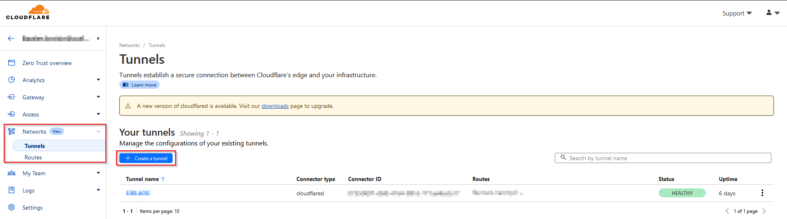
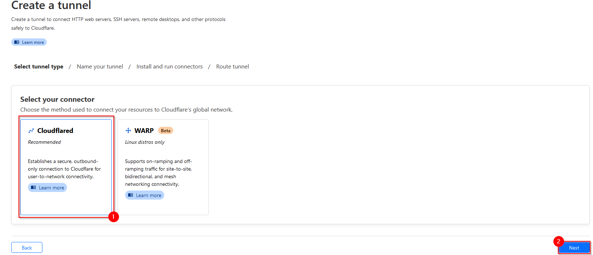
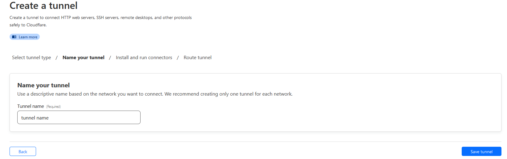
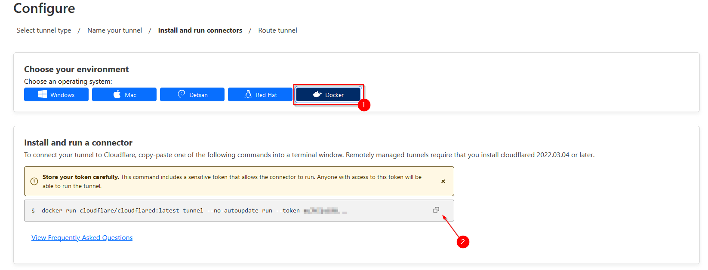

# Service
- [Cloudflared](https://one.dash.cloudflare.com/5d727414f06a81a09028b3940babbe2b/networks/tunnels)

*This service will allows you to access your service from the WAN without exposing any ports of your router nor using your public IP address.*

# Table of contents

- [Service](#service)
- [Table of contents](#table-of-contents)
- [Compose file](#compose-file)
- [Explanation of the compose file:](#explanation-of-the-compose-file)
  - [General information about the container](#general-information-about-the-container)
  - [Volumes](#volumes)
  - [Tunnel configuration](#tunnel-configuration)
    - [Tunnel Creation](#tunnel-creation)
      - [Step 1 - Create a new tunnel](#step-1---create-a-new-tunnel)
      - [Step 2 - Select the type of tunnel (Cloudflared)](#step-2---select-the-type-of-tunnel-cloudflared)
      - [Step 3 - Name your tunnel](#step-3---name-your-tunnel)
      - [Step 4 - Get your token](#step-4---get-your-token)
        - [Step 4.1 - Copy the Docker command](#step-41---copy-the-docker-command)
        - [Step 4.2 - Get your token](#step-42---get-your-token)
      - [Step 5 - Add the token to the compose file](#step-5---add-the-token-to-the-compose-file)
  - [Network](#network)
- [Run the container](#run-the-container)
- [Service Configuration](#service-configuration)

# Compose file

<details>
<summary>Click to expand</summary>


</details><br>

In this infrasctrucutre, we will use [Cloudflared](https://one.dash.cloudflare.com/5d727414f06a81a09028b3940babbe2b/networks/tunnels) as a tunneling service. <br>

> 💡 *You will need to get a domain name to use the service.*<br>

> 💡 *You can get a free domain name with [DuckDNS](https://www.duckdns.org/), or buy them to a registrar like [Cloudflare](https://cloudflare.com)*


# Explanation of the compose file:

## General information about the container
<details>
<summary>Click to expand</summary>

```yml
---
services:
  cloudflared:
    image: cloudflare/cloudflared
    container_name: cloudflare
    restart: always
    [...]
```
</details><br>

The first `cloudflared` defines the name of the service. This is the equivalent as the hostname of the container inside the docker network.<br>
We are using the official image `cloudflare/cloudflared` from Docker Hub. With no tags, the service will always use the latest version of the image.<br>
We define a `container_name` so it's easier to manage containers on our host.<br>
Finally, we define the `restart` policy to `always` so the container will always restart if it stops or if the host reboots.<br>

## Volumes
<details>
<summary>Click to expand</summary>

```yml
[...]
    volumes:
      - /etc/localtime:/etc/localtime:ro
      - /etc/localtime:/etc/timezone:ro
[...]
```
</details><br>

The two first volumes are used to synchronize the time of the container with the host. This is useful for logs and other time-related operations.<br>

## Tunnel configuration

<details>
<summary>Click to expand</summary>

```yml
[...]
    command: tunnel --no-autoupdate run --token <token_here>
[...]
```
</details>

To get your token, you'll need to go to the [Cloudflare dashboard](https://one.dash.cloudflare.com/) and go to the `Networks/Tunnels` section. You'll be able to create a new tunnel and get the token from there.

### Tunnel Creation

#### Step 1 - Create a new tunnel



#### Step 2 - Select the type of tunnel (Cloudflared)



#### Step 3 - Name your tunnel



#### Step 4 - Get your token

##### Step 4.1 - Copy the Docker command



##### Step 4.2 - Get your token

To get your token, you simply need to paste what you copied in the previous step in a text file and keep only the string after `--token`.

#### Step 5 - Add the token to the compose file

## Network
<details>
<summary>Click to expand</summary>

```yml
[...]
    networks:
      - docker_net

networks:
  docker_net:
    external:
      name: jellyfin_docker_net
```
</details>

Then, we ask the container to use the network `docker_net` with `networks: #1`.


The part `networks: #2` is different from the [`Jellyfin` service](../jellyfin/compose.yml). We are using an external network called `jellyfin_docker_net`. This network is created in the `compose.yml` file of the `Jellyfin` service. This way, the `Jellyfin` service and the `Cloudflared` service will be able to communicate with each other and also with all the other services in the same network.


# Run the container
To run the container, you can use the following command:
```bash
docker-compose up -d
```
Alternatively, you can specify the path to the compose file:
```bash
docker-compose -f /path/to/your/compose.yml up -d
```

You can check your tunnel is up and running by browsing through your tunnels list ans check its status :


# Service Configuration

Coming soon!