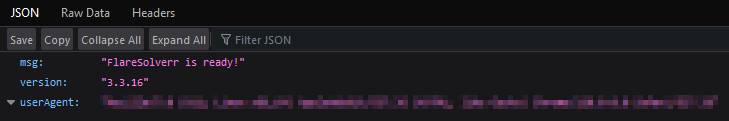

# Service
- [Flaresolverr](https://github.com/FlareSolverr/FlareSolverr)

*Flaresolverr is a proxy server that solves Cloudflare's Javascript challenges. It is designed to be used in combination with your existing scraping tools and runs on your own server. It is a standalone server that can be integrated with any software that supports HTTP proxies.*

# Table of contents
- [Service](#service)
- [Table of contents](#table-of-contents)
- [Compose file](#compose-file)
- [Explanation of the compose file:](#explanation-of-the-compose-file)
  - [General information about the container](#general-information-about-the-container)
  - [Volumes](#volumes)
  - [Specific options](#specific-options)
  - [Network](#network)
- [Run the container](#run-the-container)
- [Service Configuration](#service-configuration)

# Compose file

<details>
<summary>Click to expand</summary>


</details><br>

In this infrastructure, we will use [Flaresolverr](https://github.com/FlareSolverr/FlareSolverr) as a service. <br>

# Explanation of the compose file:

## General information about the container
<details>
<summary>Click to expand</summary>

```yml
---
services:
  flaresolverr:
    image: ghcr.io/flaresolverr/flaresolverr
    container_name: flaresolverr
    restart: unless-stopped
```
</details><br>

The first `flaresolver` defines the name of the service. This is the equivalent as the hostname of the container inside the docker network.<br>
We are using the official image `ghcr.io/flaresolverr/flaresolverr` from GitHub Repositories. With no tags, the service will always use the latest version of the image.<br>
We define a `container_name` so it's easier to manage containers on our host.<br>
Finally, we define the `restart` policy to `always` so the container will always restart if it stops or if the host reboots.<br>

## Volumes
<details>
<summary>Click to expand</summary>

```yml
[...]
    volumes:
      - /etc/localtime:/etc/localtime:ro
      - /etc/localtime:/etc/timezone:ro
      - /path/to/your/config:/config
      - 
[...]
```
</details><br>

The two first volumes are used to synchronize the time of the container with the host. This is useful for logs and other time-related operations.<br>
Then, we define where we want to store the configuration files of the service. This folder will contain information about the users and how `Flaresolverr` is configured.<br>


## Specific options

> 🔴 *There is no specific option for this service*

## Network
<details>
<summary>Click to expand</summary>

```yml
[...]
    networks:
      - docker_net
    ports:
      - "8191:8191"

networks:
  docker_net:
    external:
      name: jellyfin_docker_net
```
</details>

Then, we ask the container to use the network `docker_net` with `networks: #1` and we expose the port `8191` of the container to the host.

- 8191   is the default port of the service.

> ⚠️ *At the end of the configuration, you will have to comment or remove the `- 81:81` section as we don't want to expose the WebGUI ports of the host.*

The part `networks: #2` is different from the [`Jellyfin` service](../jellyfin/compose.yml). We are using an external network called `jellyfin_docker_net`. This network is created in the `compose.yml` file of the `Jellyfin` service. This way, the `Jellyfin` service and the `Flaresolverr` service will be able to communicate with each other and also with all the other services in the same network.

# Run the container
To run the container, you can use the following command:
```bash
docker-compose up -d
```
Alternatively, you can specify the path to the compose file:
```bash
docker-compose -f /path/to/your/compose.yml up -d
```
You'll be able to access the web interface of SERVICE by going to `http://your-server-ip:8191` or `http://your-domain-name:8191`.



You'll be able to use `Flaresolverr` within the `Radarr` and `Sonarr` services. Check their respective `README` files for more information.

# Service Configuration

Coming soon!